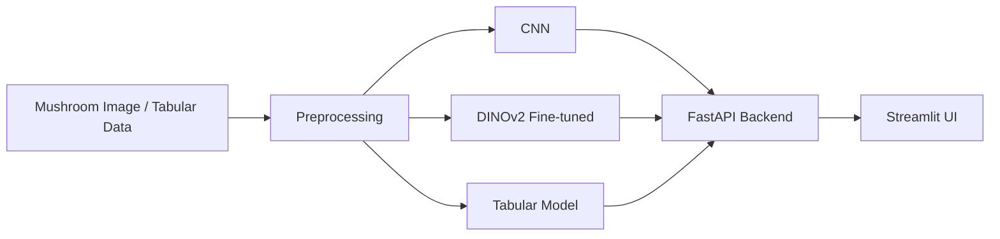

# 🍄 Kinoko Lab

[](https://github.com/ClemPera/Kinoko/actions)
[](https://kinoko.streamlit.app)

---

## 📖 Table of Contents

1. [Introduction](#-introduction)
2. [Architecture](#-architecture)
3. [Project Structure](#-project-structure)
4. [Libraries](#-libraries)
5. [Installation](#-installation)
6. [Usage](#-usage)
7. [Deployment](#-deployment)
8. [License](#-license)

---

## 🧐 Introduction

**Kinoko Lab** is an end-to-end machine & deep learning application designed to classify mushrooms as **edible** or **poisonous**, combining:

- 📊 Exploratory Data Analysis on tabular mushroom datasets
- 🧠 Tabular Machine Learning models
- 📷 Image-based Deep Learning (CNN & DINOv2 fine-tuning)
- ⚡ Real-time predictions via a FastAPI backend

Our objective was to build a complete ML & DL pipeline — from raw data exploration to production-ready deployment.

---

## 🚧 Architecture



- **Preprocessing** handles both image augmentation and tabular feature engineering
- **CNN** is a custom convolutional network trained from scratch
- **DINOv2** is a Vision Transformer fine-tuned on the mushroom image dataset
- **Tabular Model** handles tabular classification from structured mushroom features
- **FastAPI** exposes prediction endpoints consumed by the frontend
- **Streamlit** provides an interactive web interface for end users

---

## 📁 Project Structure

```
.
├── api/                   # FastAPI backend
│   ├── fast.py            # API routes & prediction endpoints
│   └── utils.py           # Helper functions
├── data/
│   ├── image_dataset/     # Mushroom images (edible / poisonous), with augmented versions
│   └── table_dataset/     # CSV tabular datasets & metadata
├── models/
│   ├── images/
│   │   ├── baseline/      # CNN baseline (model, train, evaluate, preprocess, results, logs)
│   │   └── dinov2/        # DINOv2 fine-tuning (model, inference, preprocess)
│   └── tabular/
│       └── XGBoost/       # Tabular pipeline (data, model, preprocess, registry)
├── Notebooks/             # Exploration, prototyping & dataviz notebooks
├── streamlit/
│   ├── app.py             # Streamlit web application
│   └── assets/            # UI assets (images for UI elements)
├── Dockerfile
├── docker-compose.yml
├── requirements.txt
├── requirements_api.txt
└── README.md
```

---

## 📦 Libraries

- **tensorflow / keras / keras_hub** → CNN model training and inference
- **transformers / timm** → DINOv2 Vision Transformer fine-tuning
- **xgboost** → Tabular mushroom classification
- **scikit-learn** → Preprocessing, metrics & evaluation utilities
- **pandas / numpy** → Data manipulation and numerical operations
- **matplotlib / seaborn / plotly** → Data visualization and training history plots
- **fastapi / uvicorn / python-multipart** → REST API backend for serving predictions
- **streamlit / streamlit-option-menu / altair** → Interactive web interface
- **jupyterlab / ipywidgets / ipdb** → Notebook-based exploration and prototyping
- **pytest / pylint** → Testing and code quality

---

## ⚙️ Installation

1. Clone the repository:
```bash
git clone https://github.com/ClemPera/Kinoko.git
cd Kinoko
```

2. Create and activate a Python 3.12+ virtual environment:
```bash
python3.12 -m venv env
source env/bin/activate  # On Windows: env\Scripts\activate
```

3. Install the dependencies:
```bash
pip install -r requirements.txt
```

---

## 🚀 Usage

1. **Run the API backend:**
```bash
uvicorn api.fast:app --reload
```

2. **Run the Streamlit web interface:**
```bash
streamlit run streamlit/app.py
```

3. **Run with Docker:**
```bash
docker-compose up --build
```

4. **Train a model (example — CNN Baseline):**
```bash
python models/images/baseline/main.py
```

---

## ☁️ Deployment

You can try the app directly on Streamlit without installing anything locally:

[](https://kinoko.streamlit.app)

---

## 📊 Datasets

- [image dataset](https://www.kaggle.com/datasets/derekkunowilliams/mushrooms?select=mushroom_dataset)
- [table dataset](https://archive.ics.uci.edu/dataset/848/secondary+mushroom+dataset)

## 📄 License

This project is licensed under the **GNU Affero General Public License v3.0 (AGPL-3.0)**.
See the [LICENSE](./LICENSE) file for full details.

© 2026 [ClemPera][basspeif][Seiiferu]
